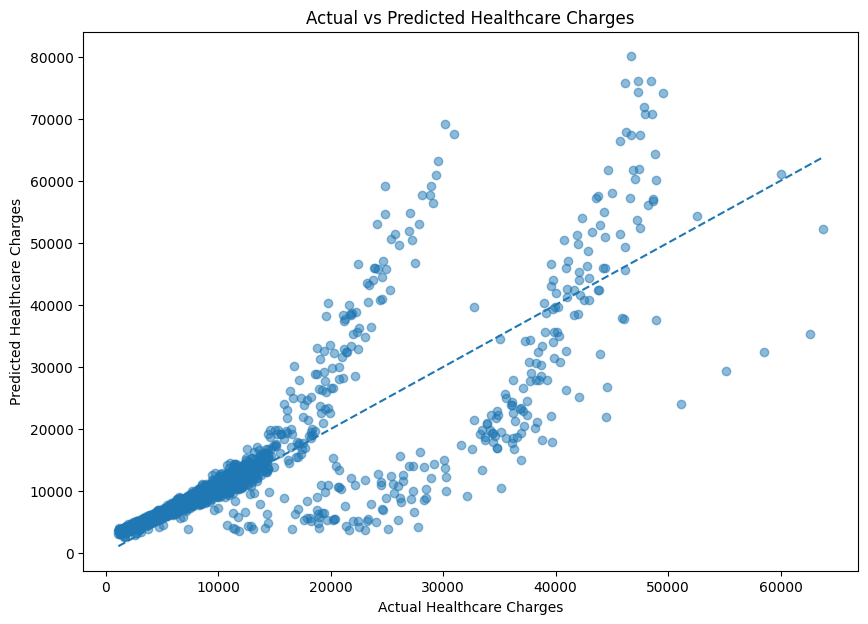
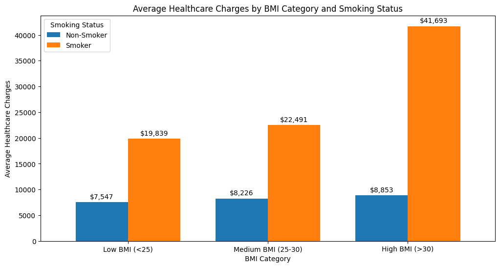
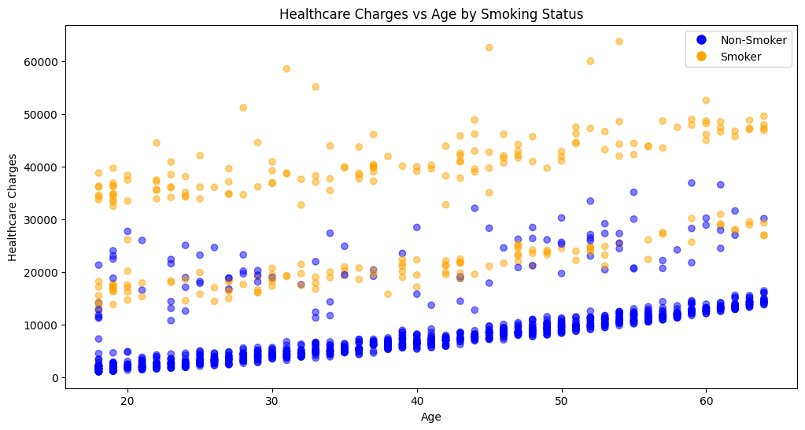

# Healthcare Severity Modeling and Actuarial Risk Segmentation

## Overview

Developed an end-to-end actuarial analytics pipeline to estimate healthcare claim severity and segment policyholders into risk tiers using demographic and behavioral risk factors.

The project combines exploratory data analysis, Gamma Generalized Linear Models (GLMs), SQL analytics, and risk segmentation techniques to evaluate healthcare expenditure patterns across 1,338 policyholders.

---

## Key Results

| Metric | Gamma GLM |
| ------ | --------: |
| MAE    | $4,387.79 |
| RMSE   | $7,711.95 |
| R²     |     0.594 |

### Major Findings

* Smoking status was the strongest predictor of healthcare expenditures.
* Obese policyholders exhibited significantly higher expected healthcare costs.
* Risk segmentation successfully separated policyholders into Low, Moderate, High, and Severe risk groups.
* Gamma GLMs provided realistic severity estimates for portfolio-level analysis.

---

## Project Workflow

```text
Raw Healthcare Data
        ↓
Exploratory Data Analysis
        ↓
Feature Engineering
        ↓
Linear Regression Benchmark
        ↓
Gamma GLM Severity Model
        ↓
Risk Segmentation
        ↓
SQL Portfolio Analytics
        ↓
Visualizations & Reporting
```

---

## Technologies

* Python
* Pandas
* NumPy
* Scikit-Learn
* Statsmodels
* SQL
* SQLite
* Matplotlib
* Jupyter Notebook
* Git/GitHub

---

## Visualizations

### Actual vs Predicted Healthcare Charges



### Healthcare Costs by BMI Group and Smoking Status



### Healthcare Charges by Age and Smoking Status



---

## SQL Analytics

The modeled dataset was loaded into SQLite to perform portfolio-level reporting and risk analysis.

Example analyses included:

* Average healthcare costs by smoking status
* Cost differences across BMI groups
* Risk-tier composition analysis
* Prediction error evaluation
* High-severity policyholder profiling

---


